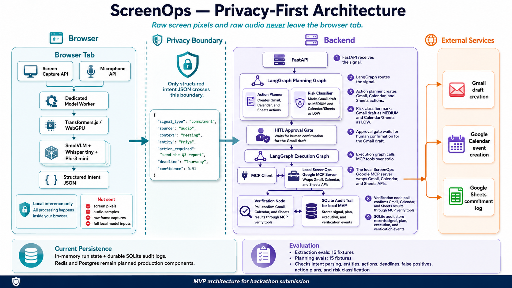
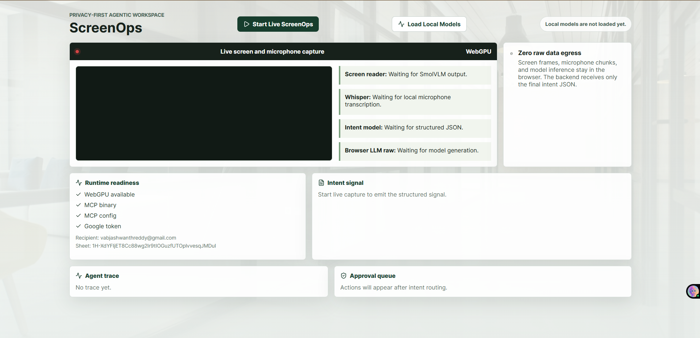
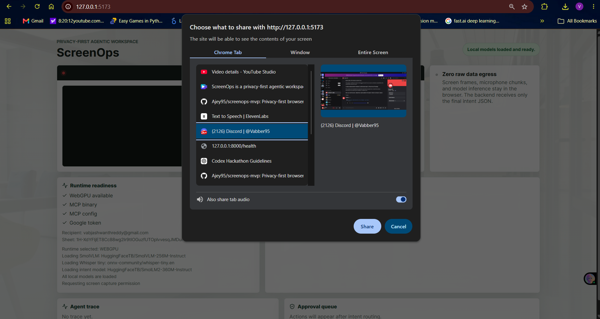
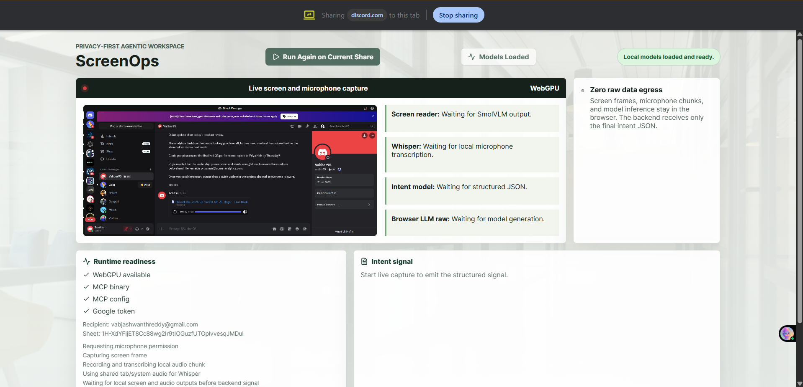
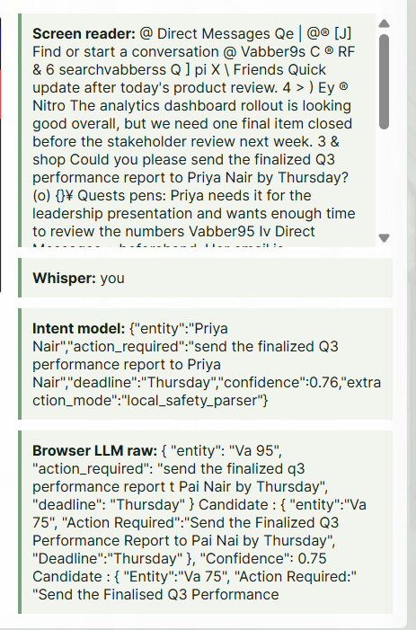
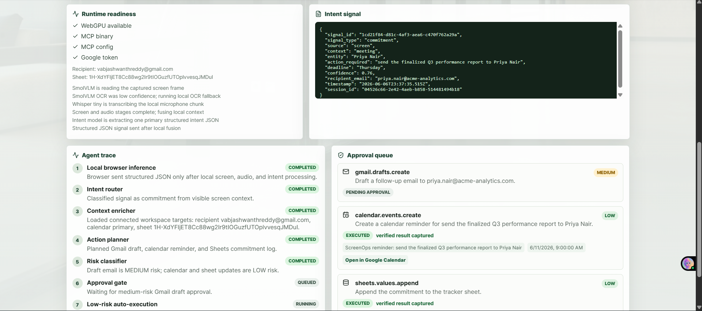
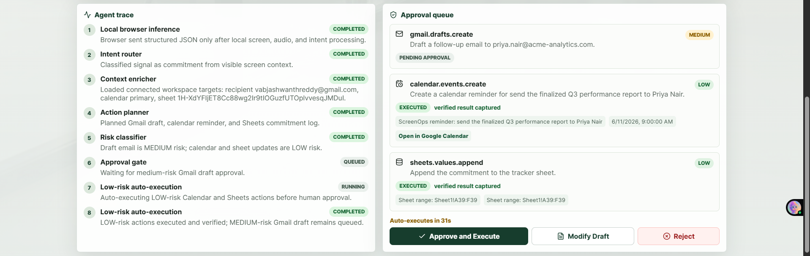
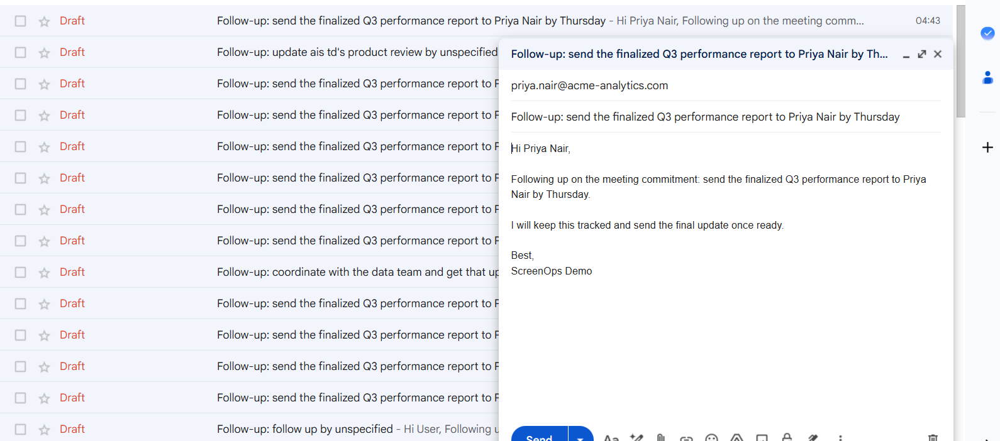
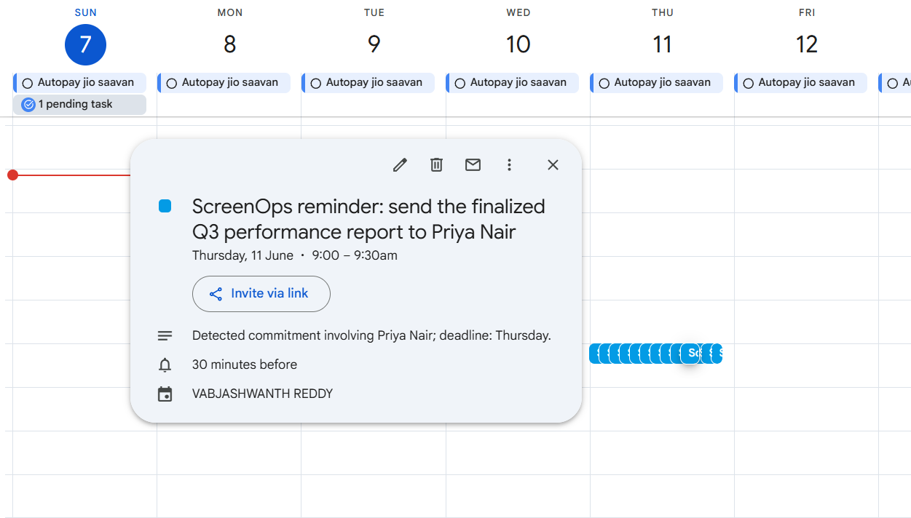
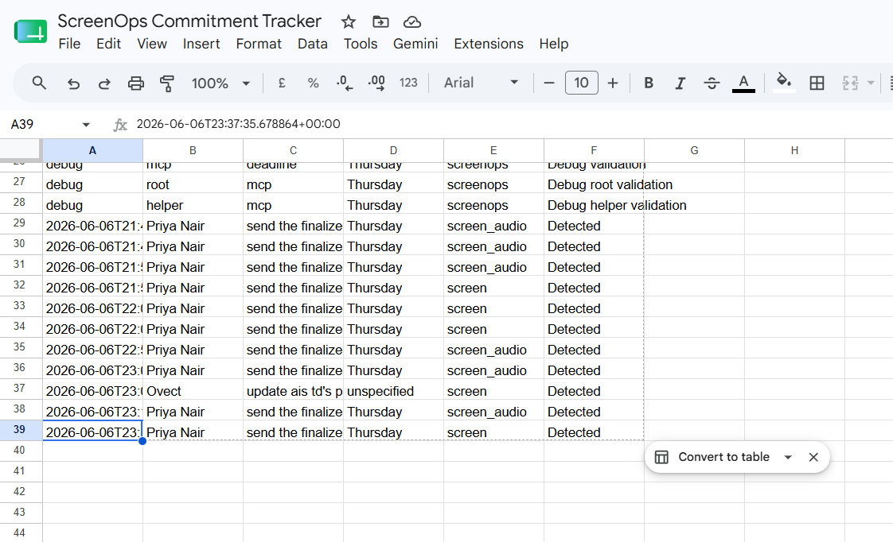

# ScreenOps

Privacy-first ambient agentic workspace intelligence.

ScreenOps watches live work context in the browser, extracts one structured work intent locally, and sends only that JSON signal to a backend agent. The backend plans real Google Workspace actions, applies risk-based approval, and verifies the result.

Repository: https://github.com/Ajey95/screenops-mvp

## Demo Link

Demo video: [Link](https://youtu.be/2djY_VtzFu8)

## Privacy-First Architecture



## Demo
In the demo, I share a real Discord screen with a message asking me to send the finalized Q3 performance report to Priya Nair by Thursday, including her email address. ScreenOps reads the screen locally, transcribes the related audio locally, and extracts one primary commitment. The Network tab is the privacy proof: no screen frame uploads, no audio file uploads, only the final structured intent JSON crosses the boundary. The backend receives that JSON, plans actions, classifies risk, waits for approval where needed, executes tools, verifies results, and records an audit trail.


## Problem Statement

Work commitments are often hidden inside meetings, chats, emails, and documents. Existing automation tools require users to manually create workflows or send sensitive context to cloud AI systems. That is a poor fit for private work environments such as finance, healthcare, legal, HR, or enterprise operations.

The screen is the richest source of context, but it is also the most sensitive.

## Solution Overview

ScreenOps keeps private sensing in the browser:

```text
Browser tab
  Screen Capture API -> SmolVLM / local OCR
  Microphone or tab audio -> Whisper tiny
  Screen + audio fusion -> browser intent model
        |
        v
Structured intent JSON only
        |
        v
FastAPI backend
        |
        v
LangGraph agent
  route -> enrich -> plan -> classify risk -> approval -> execute -> verify
        |
        v
Local MCP stdio server
  Gmail draft
  Calendar reminder
  Sheets commitment log
```

Raw screen frames and raw audio do not leave the browser tab. The backend receives only the final structured intent JSON.

## Key Features

- Live screen capture and microphone/audio capture in the browser.
- Browser-local inference with Transformers.js and WebGPU.
- SmolVLM screen understanding with local OCR fallback for noisy Discord captures.
- Whisper tiny transcription for meeting or tab audio.
- Browser intent extraction with screen-priority prompting and deterministic safety fallback.
- Intent signal schema with entity, action, deadline, confidence, source, recipient email, and session metadata.
- FastAPI backend with signal intake, approval, run lookup, auth status, and SSE event stream endpoints.
- LangGraph planning and execution workflow.
- Risk-based approval gate: low-risk Calendar/Sheets can auto-execute, medium-risk Gmail draft waits for approval.
- Local ScreenOps Google MCP server over stdio for Gmail, Calendar, Sheets, and verification tools.
- Google OAuth setup for real Workspace actions.
- SQLite audit persistence for local demo runs.
- Extraction and planning evals for repeatable validation.

## Tech Stack

- Frontend: React, Vite, TypeScript
- Browser ML: Transformers.js, WebGPU, Tesseract.js OCR
- Local models:
  - `HuggingFaceTB/SmolVLM-256M-Instruct`
  - `onnx-community/whisper-tiny.en`
  - `HuggingFaceTB/SmolLM2-360M-Instruct`
- Backend: FastAPI, Python
- Agent orchestration: LangGraph
- Tool execution: MCP over stdio
- Workspace actions: Gmail API, Google Calendar API, Google Sheets API
- Local persistence: SQLite audit log
- Evals: TypeScript extraction evals and Python planning evals

## Current Implementation Status

Implemented:

- React/Vite UI for live capture, model readiness, run trace, approval queue, and verified action results.
- Browser worker for local screen, audio, OCR, and intent inference.
- Backend signal API and LangGraph agent workflow.
- Local MCP stdio server for Google actions.
- Gmail draft creation with approval.
- Calendar event creation with relative deadline resolution in `Asia/Kolkata`.
- Sheets append to the configured commitment tracker.
- Poll-back verification for Gmail draft, Calendar event, and Sheets append.
- Modify/reject/approve controls for Gmail draft.
- SQLite audit event log.
- Extraction evals: `16/16` passing.
- Planning evals: `15/15` passing.
- Demo script, submission notes, AI usage documentation, and PRD status notes.

Partial or future work:

- Redis commitment memory.
- Postgres audit database for production.
- Generic third-party Google MCP binary integration. The demo uses the local ScreenOps MCP server because it exposes the exact Gmail draft, Calendar create, Sheets append, and verification tools needed.
- GitHub MCP stretch workflow.
- Production packaging and enterprise auth.

## Setup Instructions

Prerequisites:

- Windows machine with Chrome/Edge
- Python 3.12
- Node.js and npm
- Google Cloud OAuth desktop client
- Gmail, Calendar, Drive, and Sheets APIs enabled

Install backend dependencies:

```powershell
python -m venv .venv
.\.venv\Scripts\python -m pip install -r backend\requirements.txt
```

Install frontend dependencies:

```powershell
cd frontend
npm install
```

Run one-time Google OAuth:

```powershell
cd ..
.\.venv\Scripts\python scripts\google_auth.py
```

Start the backend used by the frontend:

```powershell
.\.venv\Scripts\python -m uvicorn app.main:app --app-dir backend --host 127.0.0.1 --port 8001
```

Start the frontend:

```powershell
cd frontend
npm run dev
```

Open:

```text
http://127.0.0.1:5173
```

## Validation

Frontend build:

```powershell
cd frontend
npm run build
```

Extraction evals:

```powershell
cd frontend
npm run eval:extraction
```

Planning evals:

```powershell
cd ..
.\.venv\Scripts\python scripts\run_evals.py
```

Latest verified local results:

- Frontend build passed.
- Extraction evals passed `16/16`.
- Planning evals passed `15/15`.
- Live API path on backend port `8001` executed and verified Calendar and Sheets through MCP.

## Codex / AI Usage

Codex/OpenAI was used meaningfully throughout the hackathon build:

- Ideation and PRD refinement.
- Architecture planning for privacy-first local inference plus backend action execution.
- Frontend implementation and UI iteration.
- Backend FastAPI, LangGraph, MCP, and Google API integration.
- Debugging WebGPU/Transformers.js model behavior.
- Debugging MCP subprocess execution on Windows.
- Writing extraction and planning evals.
- README, demo script, submission notes, and AI usage documentation.

Full AI usage documentation is in [AI_USAGE.md](AI_USAGE.md).

## Submission Materials

- Source code: this repository
- Submission summary: [SUBMISSION.md](SUBMISSION.md)
- AI usage: [AI_USAGE.md](AI_USAGE.md)
- Architecture notes: [ARCHITECTURE.md](ARCHITECTURE.md)
- PRD and status notes: [docs/ScreenOps_PRD_v1.md](docs/ScreenOps_PRD_v1.md)

## Security Notes

The repository intentionally excludes local secrets and runtime artifacts:

- `.env`
- `.screenops/`
- Google OAuth token files
- Google client secret JSON files
- `.venv/`
- `node_modules/`
- frontend build output
- local tool binaries

Use [.env.example](.env.example) as the setup template.

## Screenshots

### 1. Initial ScreenOps Dashboard



The app opens with WebGPU readiness, Google/MCP checks, the live capture panel, and empty intent/agent sections before capture starts.

### 2. Browser Screen Share Picker



Chrome prompts for the Discord tab and tab audio sharing so ScreenOps can read the live workspace locally.

### 3. Discord Share Active



The Discord tab is actively shared into ScreenOps while local models are loaded and ready.

### 4. Local Model Outputs



ScreenOps shows local screen reading, Whisper transcription, structured intent, and browser LLM raw output before backend action.

### 5. Intent Signal and Low-Risk Actions



The backend receives only structured JSON, plans actions, and executes verified low-risk Calendar and Sheets steps.

### 6. Human Approval Queue



The Gmail draft remains pending as a medium-risk action while Calendar and Sheets are already verified.

### 7. Verified Gmail Draft



Gmail contains the generated draft addressed to Priya Nair with the extracted Q3 report follow-up.

### 8. Verified Calendar Event



Google Calendar contains the ScreenOps reminder on Thursday, June 11 at 9:00 AM.

### 9. Verified Sheets Commitment Log



Google Sheets records the detected commitment with entity, action, deadline, source, and status.
